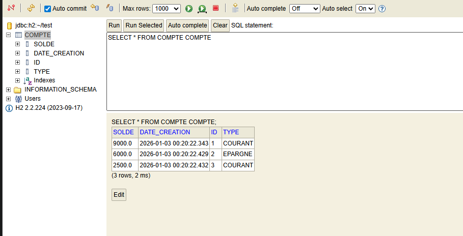

# Bank Account Service (TP8)

This is a Microservice for managing bank accounts, built with Spring Boot.

## Technologies Used
- **Java 17**
- **Spring Boot 3.2.2**
- **Spring Data JPA**
- **Spring Data REST**
- **H2 Database**
- **Lombok**
- **SpringDoc OpenAPI (Swagger)**

## H2 Database Preview
The following image shows the H2 Database Console:



## API Documentation
Once the application is running, you can access the Swagger UI at:
http://localhost:8080/swagger-ui/index.html

## How to Run
1. Ensure you have Java 17 and Maven installed.
2. Clone the repository.
3. specific the `tp8` folder.
4. Run the application:
   ```bash
   mvn spring-boot:run
   ```
